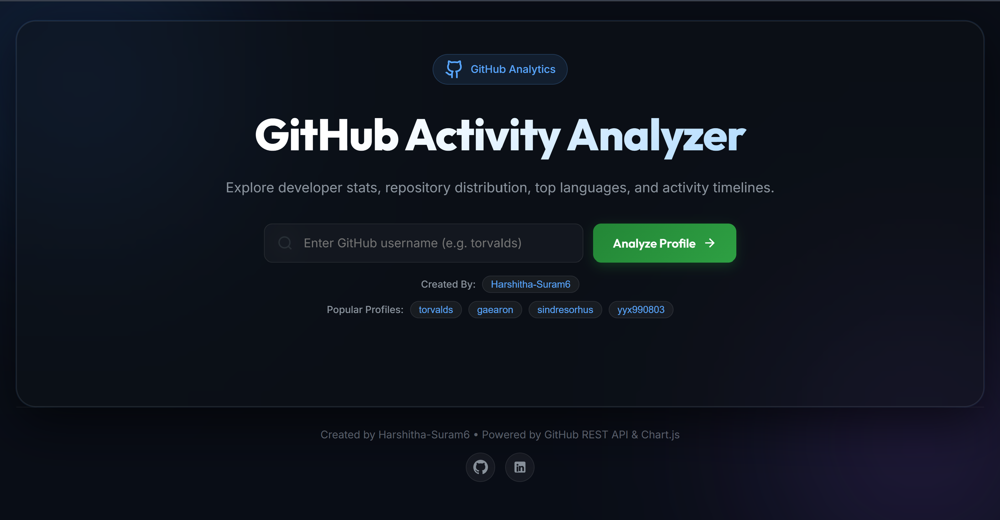
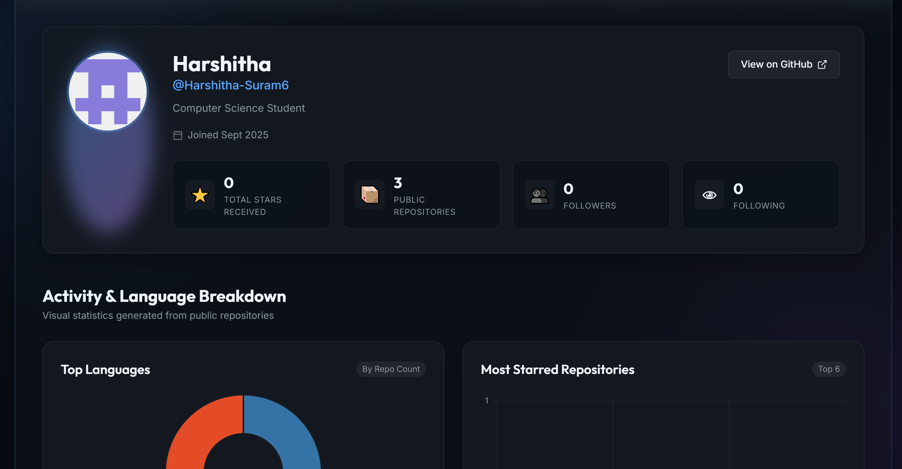

# 📊 GitHub Activity Analyzer

A lightweight, dark-themed web application to search any GitHub profile and get instant visual analytics on repository distributions, top programming languages, and activity timelines.

Built with **HTML5**, **CSS3**, **JavaScript (ES6)**, and **Chart.js**, powered directly by the **GitHub REST API**.

---

## 📷 Previews

### Search & Landing View


### Profile Metrics & Chart Analytics


---

## ✨ Features

- 🔍 **Instant Profile Search**: Query any public GitHub account with live input validation and quick suggestion chips.
- 📈 **Interactive Visualizations**:
  - 🍩 **Top Languages**: Doughnut breakdown of most used languages across public repos.
  - 📊 **Most Starred Repos**: Bar chart showcasing top 6 projects by star count.
  - 📈 **Creation Timeline**: Line chart tracking repo creation activity per year.
- 📦 **Featured Repositories Showcase**: Interactive cards displaying star counts, fork counts, main language indicators, descriptions, and direct repo links.
- 👤 **Rich Profile Metadata**: Displays total stars accumulated across public repos, follower counts, following count, bio, company, location, website link, and join date.
- 🎨 **Glassmorphism Dark UI**: Modern dark layout with subtle gradient glow effects, smooth hover micro-interactions, and responsive framing.
- ⚡ **Zero Build Setup Needed**: Built with vanilla frontend web standards — runs out of the box in any browser.

---

## 🛠️ Built With

- **Frontend Core**: HTML5 & ES6+ JavaScript (`async/await`, Fetch API)
- **Styling**: Vanilla CSS3 (CSS Variables, Flexbox, CSS Grid, Glassmorphism `backdrop-filter`)
- **Charts**: [Chart.js](https://www.chartjs.org/) (CDN)
- **Data Source**: [GitHub REST API](https://docs.github.com/en/rest) (`/users/{username}` & `/users/{username}/repos`)

---

## 🚀 How to Run Locally

No `npm install` or complex build steps required.

1. **Clone the repository**:
   ```bash
   git clone https://github.com/Harshitha-Suram6/github-activity-analyzer.git
   cd github-activity-analyzer
   ```

2. **Open in your browser**:
   Simply double-click `index.html` or open it with Live Server / python static server:
   ```bash
   python -m http.server 8000
   ```
   Navigate to `http://localhost:8000` in your web browser.

---

## 📁 Project Structure

```text
github-analyzer/
├── index.html        # HTML layout & semantic containers
├── style.css         # Dark glassmorphism theme & responsive styles
├── app.js            # GitHub REST API fetching & Chart.js logic
├── 1.png             # Screenshot - Search hero section
├── 2.png             # Screenshot - Profile analytics & charts
└── README.md         # Project documentation
```

---

## 👤 Author

**Harshitha Suram**
- GitHub: [@Harshitha-Suram6](https://github.com/Harshitha-Suram6)
- LinkedIn: [harshi06](https://www.linkedin.com/in/harshi06/)

---

## 📄 License

This project is licensed under the MIT License - feel free to use and customize it!
